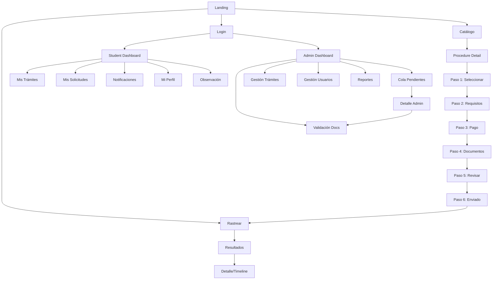

# Walkthrough — TUPA UNSAAC Prototype Refactoring

## What Was Built

A fully navigable, Figma-aligned static HTML prototype of the **TUPA UNSAAC** institutional portal, replacing the Stitch-generated originals with a cohesive design system.

---

## Verification Results

All screens tested at **http://127.0.0.1:5500** — zero console errors (only the expected `favicon.ico` 404).

| Screen | Rating | Notes |
|--------|--------|-------|
| Landing page | 5/5 | Hero, cards, public topbar |
| Login | 5/5 | Split layout, role selector, SSO option |
| Student Dashboard | 5/5 | Navy sidebar, topbar, stats, wizard shortcut |
| Admin Dashboard | 5/5 | 5 KPI cards, queue table, quick actions |
| Reports & Stats | 5/5 | Bar chart, donut, top procedures table |
| Expediente Detail Timeline | 5/5 | Progress bar, 6-step timeline, sidebar |

---

## Screenshots

````carousel

<!-- slide -->

<!-- slide -->

<!-- slide -->

<!-- slide -->

<!-- slide -->

````

---

## Shared Infrastructure

| File | Purpose |
|------|---------|
| [design-system.css](file:///d:/Ing%20de%20sistemas/Acad%C3%A9mico/INGENIERIA%20DE%20SISTEMAS%202023-1%20UNSAAC/CICLO%207/DESARROLLO%20DE%20SOFTWARE%20I/Proyecto-Semestral-TUPA-UNSAAC/stitch_institutional_tupa_portal/shared/design-system.css) | Design tokens, typography, layout, all component classes |
| [navigation.js](file:///d:/Ing%20de%20sistemas/Acad%C3%A9mico/INGENIERIA%20DE%20SISTEMAS%202023-1%20UNSAAC/CICLO%207/DESARROLLO%20DE%20SOFTWARE%20I/Proyecto-Semestral-TUPA-UNSAAC/stitch_institutional_tupa_portal/shared/navigation.js) | Route table, breadcrumbs, wizard stepper, tabs, modals, search, toasts |
| [components.js](file:///d:/Ing%20de%20sistemas/Acad%C3%A9mico/INGENIERIA%20DE%20SISTEMAS%202023-1%20UNSAAC/CICLO%207/DESARROLLO%20DE%20SOFTWARE%20I/Proyecto-Semestral-TUPA-UNSAAC/stitch_institutional_tupa_portal/shared/components.js) | StudentSidebar, AdminSidebar, PublicTopbar, StudentTopbar, AdminTopbar, StatCard, TimelineItem, DocumentItem, NotificationItem, Toast |

---

## Screen Count: 41 Total

### Public Portal (4 canonical)
- Landing · Login · Registration · Help

### Catalog (6 canonical)
- Catalog hub · List view · Accordion view · Grid view · Institutional Framework · Procedure Detail (Diploma)

### Wizard — Spanish (6 canonical) + 7 redirects
- Paso 1–6 (Spanish canonical) · Paso 1 v2 (redirect) · Steps 1–6 EN (redirects to ES)

### Student Portal (9 canonical)
- Dashboard · Mis Trámites · Mis Solicitudes · Notificaciones · Mi Perfil · Nueva Solicitud · Observación · Rastrear Trámite · Resultados · Detalle/Timeline

### Admin Portal (8 canonical)
- Dashboard · Cola de Pendientes · Validación de Documentos · Gestión de Procedimientos · Gestión de Usuarios · Reportes · Detalle Administrativo · Overview (redirect)

---

## Navigation Graph



---

## How to Run

```bash
# In the stitch_institutional_tupa_portal folder:
python -m http.server 5500
# Then open: http://127.0.0.1:5500/tupa_central_home/code.html
```

Or open any `code.html` file directly in a browser — navigation uses relative paths so it works without a server too.

---

> **Figma source of truth:** [Sistema TUPA](https://www.figma.com/design/PsfoxVoyh6v3UdapMo3aw8/Sistema-TUPA)  
> **All content is static/front-end only — no backend, no database, no authentication implemented.**
